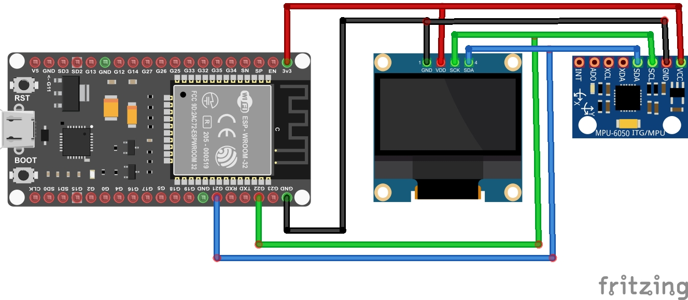

# Projeto: Acelerômetro e Giroscópio de 3 eixos com ESP32S e Display OLED 128x64 0.96" SSD1306

 

## Descrição
Neste projeto vamos utilizar um microcontrolador ESP32S e um modulo GY-521 MPU6050 para exibir coordenadas de posicionamento, bem como o valor da temperatura ambiente, num display OLED SSD1306.

## Introdução
O MPU-6050 integra um acelerômetro e um giroscópio MEMS em um único chip. Com três eixos para o acelerômetro e três para o giroscópio, oferece um total de 6 graus de liberdade (6DOF) e proporciona uma ampla gama de detecção de movimento e orientação. Além disso, o módulo GY-521 inclui um sensor de temperatura embutido, permitindo medições precisas na faixa de -40°C a +85°C.

## Principais características:

* Comunicação via protocolo I2C
* Sensor de temperatura integrado
* ADC de 16 bits
* Baixo consumo de energia

#### Pinagem do Modulo GY-521 MPU6050 I2C

|Pino|Descrição|
| :---: | :---: |
|VCC|Pino de alimentação, geralmente conectado a uma fonte de 3.3V ou 5V.|
|GND|Pino de terra, conectado ao terra do sistema.|
|SCL|Pino de Clock Serial, usado para comunicação I2C.|
|SDA|Pino de Dados Serial, também usado para comunicação I2C.|
|XDA|Saída de dados auxiliar para comunicação I2C.|
|XCL|Clock auxiliar para comunicação I2C.|
|AD0|Pino de endereço. Pode ser usado para alterar o endereço I2C do dispositivo.|
|INT|Pino de interrupção, usado para notificar o microcontrolador sobre eventos como detecção de movimento.|

## Pré-requisitos
* Ter a [IDE](https://www.arduino.cc/en/software/) do Arduino instalada e configurada;
* Instalar a biblioteca GY6050 e todas as suas dependencias;

## Material Necessário
* Microcontrolador ESP32 ou ESP32s;
* Modulo GY-521 MPU6050 I2C;
* Protoboard e jumpers;
* Cabo de dados para conexão do microcontrolador ao PC.

## Tabela de Conexões

|Pinos do ESP32S|Pinos do Display SSD1306|Pinos do Modulo MPU6050|
| :---: | :---: | :---: |
|3.3 V (1)|VCC (2)|VCC (1)|
|GND (38)|GND (1)|GND (2)|
|D22 (36)|SCL (3)|SCL (3)|
|D21 (33)|SDA (4)|SDA (4)|

## Imagem das Conexões

